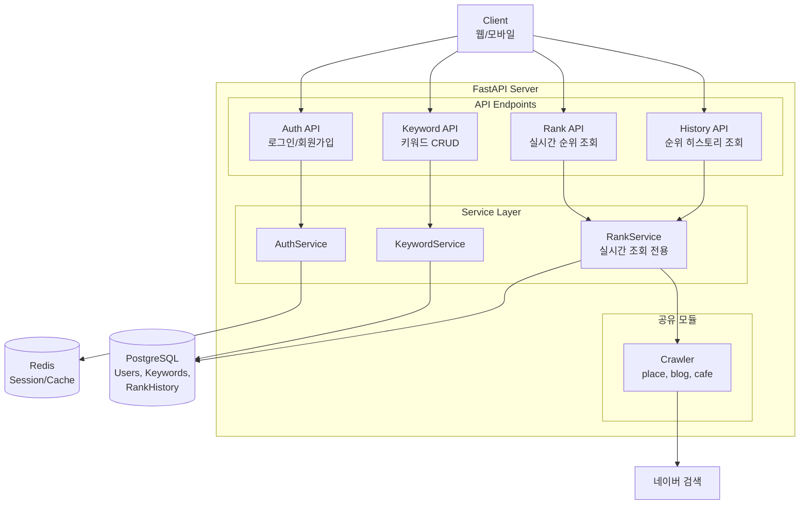
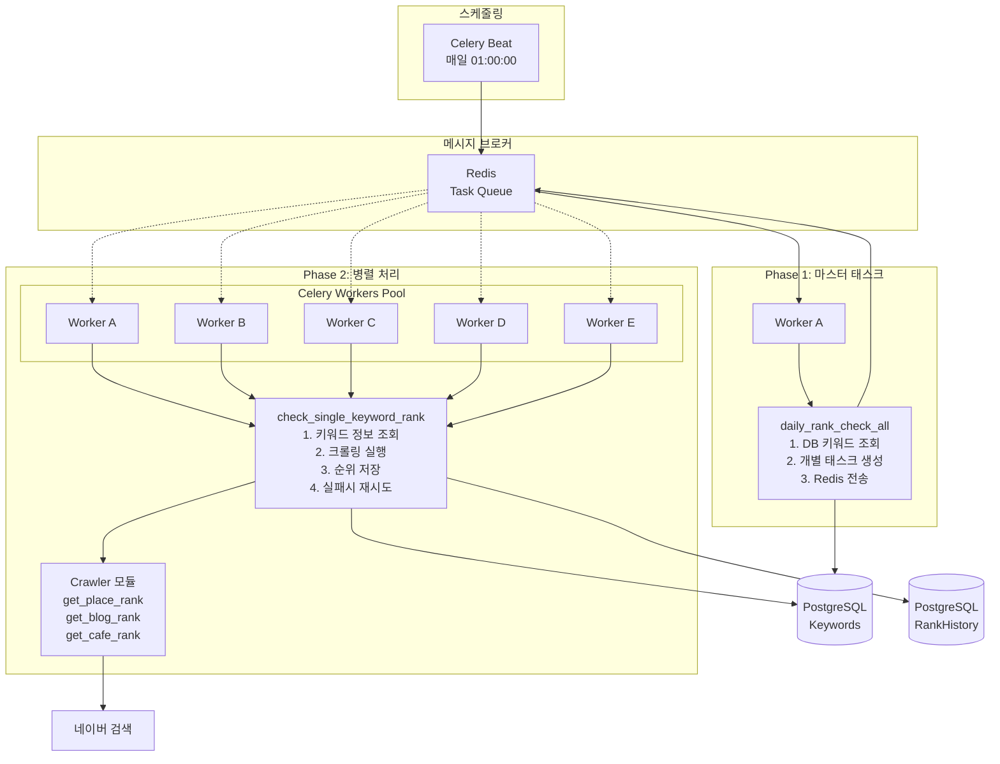

# 네이버 검색 순위 확인 사이트

## 요구사항 정의서 및 기술 스택

## 1. 프로젝트 개요

### 1.1 목적

네이버 검색 결과에서 특정 콘텐츠(플레이스, 블로그, 카페)의 노출 순위를 확인하고, 일별 순위 변동을 트래킹하는 웹 서비스

### 1.2 주요 기능

- 검색어 + URL 입력 시 해당 콘텐츠의 현재 순위 조회
- 등록된 키워드에 대한 일일 자동 순위 트래킹
- 순위 변동 히스토리 조회

---

## 2. 기능 요구사항

### 2.1 검색 대상

| 구분   | 설명 | 식별 방식          |
|------|------|----------------|
| 플레이스 | 네이버 지도/플레이스 검색 결과 | URL 내 Place ID |
| 블로그  | 인기글 섹션 | 블로그 글 ID       |
| 카페   | 인기글 섹션  | 카페 글 ID        |

### 2.2 순위 조회

- 조회 범위: 검색 결과 첫 화면에 노출되는 항목까지
- 실시간 조회: 사용자가 키워드 + URL 입력 시 즉시 순위 반환
- 미노출 처리: 첫 화면 내 미노출 시 "순위권 외" 표시

### 2.3 순위 트래킹

- 기본 주기: 1일 1회
- 확장 구조: 향후 다중 체크 가능하도록 설계
- 트래킹 시작: 키워드 등록 시점부터
- 데이터 보관: 무제한 (전체 히스토리 DB 저장)

### 2.4 사용자 기능

| 기능 | 설명 |
|------|------|
| 회원가입 | 이메일 + 비밀번호 |
| 로그인 | 쿠키 기반 세션, Remember Me 지원 |
| 키워드 등록 | 검색어 + URL + 검색 대상(플레이스/인기글) |
| 순위 조회 | 등록된 키워드의 현재 순위 확인 |
| 히스토리 조회 | 일별 순위 변동 내역 |
| 키워드 관리 | 등록/수정/삭제 |

### 2.5 제외 범위 (v1.0)

- 관리자 기능
- 알림 기능 (이메일, 카카오톡 등)
- 소셜 로그인
- 사용자별 키워드 수 제한

---

## 3. 비기능 요구사항

### 3.1 성능

- 실시간 순위 조회: 10초 이내 응답
- 일일 배치: 전체 키워드 처리 완료 (새벽 시간대)

### 3.2 확장성

- 트래킹 주기 확장 가능한 구조
- 검색 대상 타입 추가 가능한 구조

### 3.3 안정성

- 네이버 차단 대응: Rate Limiting, User-Agent 로테이션
- 크롤링 실패 시 재시도 로직

---

## 4. 기술 스택

### 4.1 Backend

| 구분 | 기술 | 버전 | 선정 사유 |
|------|------|------|-----------|
| Language | Python | 3.11+ | 크롤링 생태계, 빠른 개발 |
| Framework | FastAPI | 0.100+ | 비동기 지원, 자동 API 문서화, 타입 힌트 |
| ORM | SQLAlchemy | 2.0+ | 비동기 지원, 성숙한 생태계 |
| Migration | Alembic | 1.12+ | SQLAlchemy 공식 마이그레이션 도구 |

### 4.2 크롤링

| 구분 | 기술 | 용도 |
|------|------|------|
| HTTP Client | httpx | 비동기 HTTP 요청 |
| HTML Parser | BeautifulSoup4 | 정적 HTML 파싱 |
| Browser Automation | Playwright | 동적 렌더링 대응 (필요 시) |

### 4.3 스케줄링 & 작업 큐

| 구분 | 기술 | 용도 |
|------|------|------|
| Task Queue | Celery | 비동기 작업 처리, 분산 처리 |
| Scheduler | Celery Beat | 주기적 작업 스케줄링 |
| Broker | Redis | 메시지 브로커, 작업 큐 |

### 4.4 데이터베이스

| 구분 | 기술 | 용도 |
|------|------|------|
| Primary DB | PostgreSQL 15+ | 메인 데이터 저장 |
| Cache | Redis | 세션 저장, 캐싱 |

### 4.5 인증

| 구분 | 기술 | 설명 |
|------|------|------|
| Session | Cookie 기반 | HTTP-Only, Secure Cookie |
| Remember Me | 장기 세션 토큰 | 별도 테이블 관리, 만료 기간 연장 |
| Password | bcrypt | 비밀번호 해싱 |

### 4.6 인프라

| 구분 | 기술 | 용도 |
|------|------|------|
| Container | Docker | 애플리케이션 컨테이너화 |
| Orchestration | Docker Compose | 로컬/개발 환경 구성 |
| Cloud | TBD | 클라우드 배포 (AWS/GCP/NCP 등) |

---

## 5. 시스템 아키텍처





### 5.1 주요 흐름

| 케이스 | 흐름 | 저장 |
|--------|------|------|
| 실시간 순위 조회 | Client → Rank API → RankService → Crawler → 네이버 | X |
| 히스토리 조회 | Client → Rank API → PostgreSQL | - |
| 일일 배치 | Celery Beat → Celery Worker → RankService → Crawler → PostgreSQL | O |

### 5.2 공통 모듈

- **Crawler**: 네이버 크롤링 로직 (place, blog, cafe)
- **RankService**: 크롤러 호출 + 비즈니스 로직
  - `check_rank()`: 순위 조회만 (실시간용)
  - `check_and_save_rank()`: 순위 조회 + DB 저장 (배치용)

---

## 6. 프로젝트 구조

```
naver-rank-tracker/
├── docker-compose.yml
├── Dockerfile
├── requirements.txt
├── alembic/
│   └── versions/
├── app/
│   ├── main.py
│   ├── config.py
│   ├── database.py
│   ├── api/
│   │   ├── v1/
│   │   │   ├── auth.py
│   │   │   ├── keywords.py
│   │   │   └── ranks.py
│   │   └── deps.py
│   ├── models/
│   │   ├── user.py
│   │   ├── keyword.py
│   │   └── rank_history.py
│   ├── schemas/
│   │   ├── user.py
│   │   ├── keyword.py
│   │   └── rank.py
│   ├── services/
│   │   ├── auth.py
│   │   ├── keyword.py
│   │   └── rank.py
│   ├── crawler/
│   │   ├── base.py
│   │   ├── place.py
│   │   ├── popular_post.py
│   │   └── cafe.py
│   └── tasks/
│       ├── celery.py
│       └── rank_check.py
├── tests/
└── docs/
```

---

## 7. 리스크 및 대응

| 리스크 | 영향 | 대응 방안 |
|--------|------|-----------|
| 네이버 크롤링 차단 | 서비스 불가 | Rate limiting, UA 로테이션 |
| IP 차단 | 서비스 불가 | Rotating Proxy 사용으로 요청마다 IP 변경 |
| 네이버 HTML 구조 변경 | 크롤링 실패 | 크롤러 즉시 수정 필요 (연 2~4회 예상) |
| 대량 키워드 처리 지연 | 일일 체크 미완료 | Celery 워커 스케일 아웃 |

---

## 8. 향후 확장 고려사항

- 관리자 기능
- 순위 변동 알림 (이메일, 카카오톡)
- 검색 대상 확장 (블로그, 카페, VIEW 탭 등)
- 트래킹 주기 커스터마이징
- 경쟁사 순위 비교 기능
- 리포트 다운로드 (PDF, Excel)